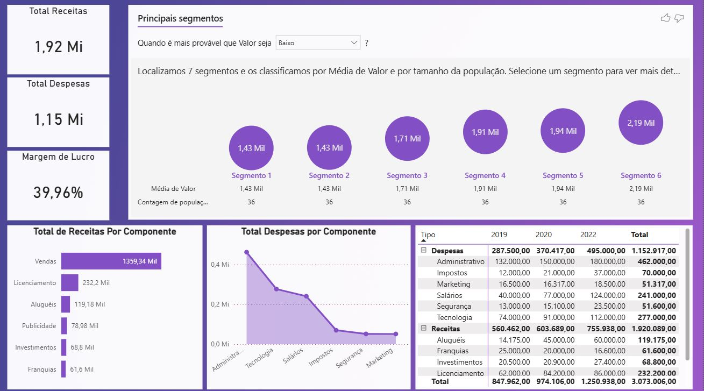

# Dashboard de Análise de Performance Financeira
Este projeto consiste em um dashboard estratégico para monitoramento de saúde financeira empresarial. A análise foca no equilíbrio entre receitas e despesas, margens de lucro e identificação de padrões através de Inteligência Artificial para segmentação de dados.

# 📊 Visão Geral do Dashboard
<p align="center">
  <b>Visão 1: Dashboard</b><br>
  
</p>

O relatório oferece uma visão clara e objetiva dos resultados financeiros:

**KPIs Principais:** Visualização imediata de Receitas Totais (1,92 Mi), Despesas Totais (1,15 Mi) e Margem de Lucro (39,96%).

**Análise de Segmentos (IA):** Utilização do visual de Key Influencers para identificar quais componentes e períodos mais impactam as médias financeiras.

**Detalhamento por Componente:** Gráficos de barras e linhas que discriminam as maiores fontes de receita (Vendas) e os maiores centros de custo (Administrativo).

**DRE Simplificada:** Tabela matricial com a evolução anual (2019, 2020, 2022) detalhada por tipo e componente.

# 🧮 Inteligência de Dados (DAX)
As métricas foram construídas para permitir uma análise comparativa e de margem, utilizando funções de contexto e filtragem avançada:

**💰 Margem de Lucro %**
Cálculo da rentabilidade líquida sobre a receita total:

```
Margem de Lucro % = 
VAR Lucro = [Total Receitas] - [Total Despesas]
RETURN
DIVIDE(Lucro, [Total Receitas], 0)
```

**📉 Comparativo de Despesas**
Uso da função ALL para criar uma média de referência que ignora filtros de linha, permitindo o cálculo da variação percentual:

```
Média Geral Despesas = 
CALCULATE(
    AVERAGEX(
        VALUES(DadosFinanceiros[Componente]), 
        [Total Despesas]
    ),
    DadosFinanceiros[Tipo] = "Despesas",
    ALL(DadosFinanceiros[Componente])
)

Despesa vs Média % = 
DIVIDE(
    [Total Despesas] - [Média Geral Despesas], 
    [Média Geral Despesas]
)
```
# 📈 Insights Extraídos
**Rentabilidade Saudável:** A margem de lucro consolidada de 39,96% indica uma operação eficiente.

**Concentração de Receita:** O componente de Vendas é responsável pela vasta maioria do faturamento (1.359 Mi), seguido por Licenciamento.

**Controle de Custos:** A maior despesa está concentrada no setor Administrativo, que apresenta uma tendência crescente ano após ano conforme observado na tabela matricial.

**Descoberta de Segmentos:** O visual de IA identificou grupos específicos onde a média de valor flutua, permitindo uma investigação detalhada em "Segmentos de Baixo Valor" para otimização de recursos.
